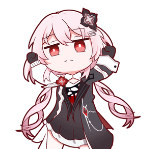

# Hi, I'm MOB-06 👋

I'm a 1st sem student learning software development and building projects to improve my skills.

## 👨‍💻 About me
- 🎓 Student
- 🌱 Currently learning: **Python, Java, Web Dev, React, prompt coding  etc.**
- 🎯 Goal: **build apps, get internship, contribute to open source, etc.**
- 📍 Location: **KTM**

## 🧰 Skills / Tools

  
  
  
  
  
  
  
  
  
  
  
  
  

##

  

## 🎮 Contribution Graph

## 📌 Projects 
- **Project 1:** [Personal Portfolio](https://ajitadhikari1.com.np) — personal portfolio
- **Project 2:** [Test Game](https://spiffy-longma-8676e8.netlify.app) — test game though only works on pc

## 📫 Contact

  
  
  
  

 
- Instagram: https://www.instagram.com/e_re_b_us?igsh=MXU1dzB1aGxkYTJtZw== 
- Email: **ajitadhikari18@gmail.com**

---
⭐ Thanks for visiting my profile!
